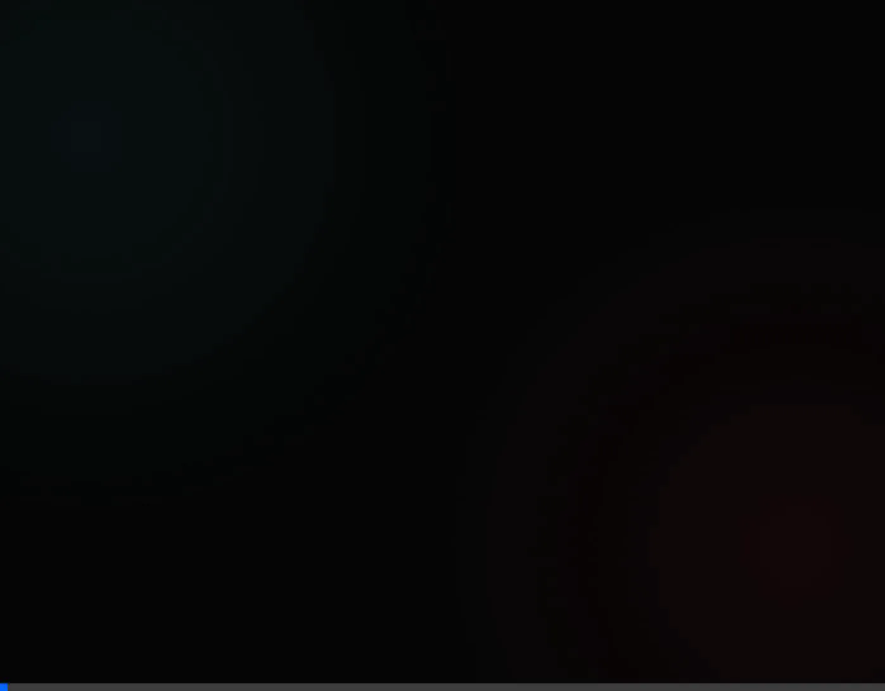

# Tic Tac Toe | Minimalist Premium & Real-time P2P



A stunningly minimalist, high-performance Tic Tac Toe game. Now enhanced with **real-time multiplayer capabilities** powered by **GenosDB**, allowing decentralized P2P matches without a central server.

## ✨ Features
- **Real-time Multiplayer**: Decentralized synchronization using GenosDB P2P protocol.
- **Room System**: Create or join specific battle rooms using a unique ID.
- **Premium Design**: Glassmorphic UI with vibrant neon accents and smooth transitions.
- **Role Assignment**: Automatic assignment of Player X, Player O, or Spectator mode.
- **Ultra-Compact**: Entire application contained in a single standalone HTML file.
- **Modern Tech**: Zero dependencies, utilizing modern JS features (ES2024 style).
- **Responsive**: Fully optimized for mobile, tablet, and desktop.
- **Aesthetics**: Curated color palette (Neon Blue & Ruby Red) and modern typography (Inter & Outfit).

## 🚀 How to Run
Due to modern browser security policies regarding Web Workers and OPFS (Origin Private File System) used by GenosDB, the application **must be served via HTTP/HTTPS** (it won't work using `file://` protocol).

### Using Bun (Recommended)
```bash
bun x serve ./
```

### Using PNPM / NPM
```bash
npx serve ./
```
Then open `http://localhost:5000` in your browser. Open it in two different tabs or devices to test the real-time sync!

## 🛠️ Architecture
- **Database**: [GenosDB](https://github.com/estebanrfp/gdb) for real-time P2P graph synchronization.
- **Frontend**: Vanilla HTML5, CSS3 (Variables, Grid, Backdrop-filter), and Modern JavaScript.
- **State Management**: Reactive P2P state synchronization with defensive coding to handle distributed updates.

## 📄 License
This project is licensed under the MIT License - see the [LICENSE.md](LICENSE.md) file for details.

## Author

Esteban Fuster Pozzi (@estebanrfp) — Full Stack JavaScript Developer
